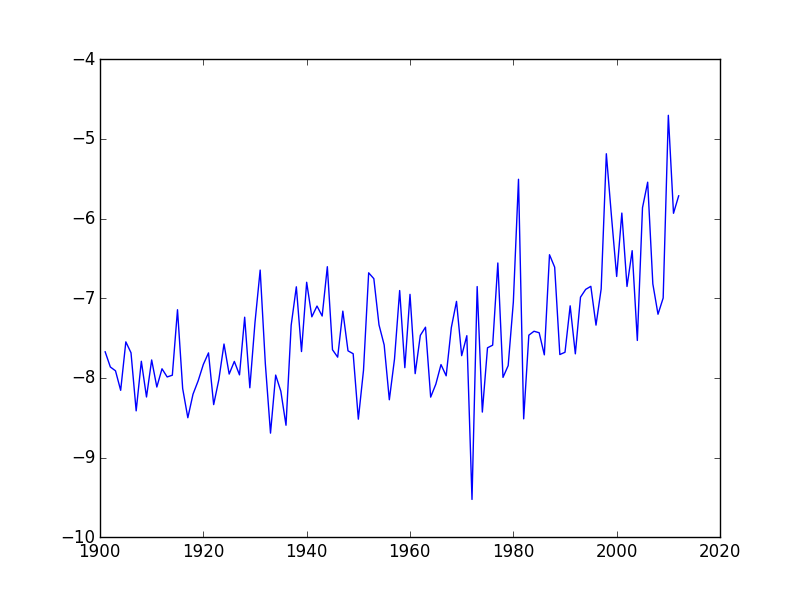
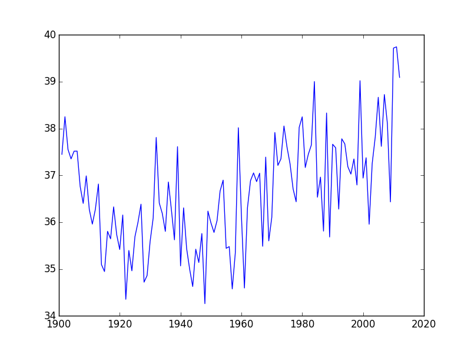
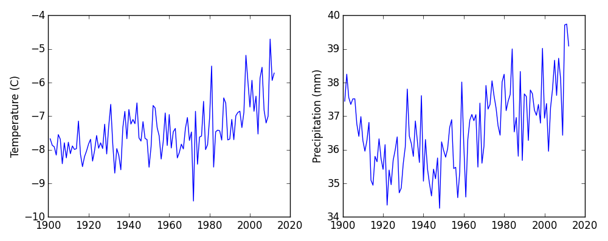

Words are useful,
but what's more useful are the sentences and stories we build with them.
Similarly,
while a lot of powerful, general tools are built into languages like Python,
specialized tools built up from these basic units live in [libraries]({{ site.github.url }}/reference/#library)
that can be called upon when needed.

In order to load our data,
we need to access ([import]({{ site.github.url }}/reference/#import) in Python terminology)
a library called [NumPy](http://docs.scipy.org/doc/numpy/ "NumPy Documentation").
In general you should use this library if you want to do fancy things with numbers,
especially if you have matrices or arrays.
We can import NumPy using:

~~~
import numpy
~~~
{: .python}

Importing a library is like getting a piece of lab equipment out of a storage locker and setting it up on the bench.
Libraries provide additional functionality to the basic Python package,
much like a new piece of equipment adds functionality to a lab space.
Once you've imported the library,
we can ask the library to read our data file for us:

~~~
numpy.loadtxt(fname='CAN.csv', delimiter=',', skiprows=1)
~~~
{: .python}

~~~
array([[ 1901.        ,    -7.67241907,    37.44835281],
       [ 1902.        ,    -7.86271143,    38.25142288],
       [ 1903.        ,    -7.91078281,    37.5530014 ],
       [ 1904.        ,    -8.15572929,    37.35193253],
       [ 1905.        ,    -7.54731131,    37.51586914],
       [ 1906.        ,    -7.68410349,    37.51700592],
       [ 1907.        ,    -8.41355324,    36.76292038],
       [ 1908.        ,    -7.79092932,    36.40164948],
       [ 1909.        ,    -8.2393055 ,    36.98836136],
       [ 1910.        ,    -7.77461147,    36.27269745],
       [ 1911.        ,    -8.11444664,    35.95967865],
~~~
{: .output}

The expression `numpy.loadtxt(...)` is a [function call]({{ site.github.url }}/reference/#function-call)
that asks Python to run the [function]({{ site.github.url }}/reference/#function) `loadtxt` which belongs to the `numpy` library.
This [dotted notation]({{ site.github.url }}/reference/#dotted-notation) is used everywhere in Python
to refer to the parts of things as `thing.component`.

`numpy.loadtxt` has two [parameters]({{ site.github.url }}/reference/#parameter):
the name of the file we want to read,
and the [delimiter]({{ site.github.url }}/reference/#delimiter) that separates values on a line.
These both need to be character strings (or [strings]({{ site.github.url }}/reference/#string) for short),
so we put them in quotes.

When we are finished typing and press Shift+Enter,
the notebook runs our command.
Since we haven't told it to do anything else with the function's output,
the notebook displays it.
In this case,
that output is the data we just loaded.
By default,
only a few rows and columns are shown
(with `...` to omit elements when displaying big arrays).
To save space,
Python displays numbers as `1.` instead of `1.0`
when there's nothing interesting after the decimal point.

Our call to `numpy.loadtxt` read our file,
but didn't save the data in memory.
To do that,
we need to [assign]({{ site.github.url }}/reference/#assignment) the array to a [variable]({{ site.github.url }}/reference/#variable).
A variable is just a name for a value,
such as `x`, `current_temperature`, or `subject_id`.
Python's variables must begin with a letter and are [case sensitive]({{ site.github.url }}/reference/#case-sensitive).
We can create a new variable by assigning a value to it using `=`.
As an illustration,
let's step back and instead of considering a table of data,
consider the simplest "collection" of data,
a single value.
The line below assigns the value `55` to a variable `weight_kg`:

~~~
weight_kg = 55
~~~
{: .python}

Once a variable has a value, we can print it to the screen:

~~~
print(weight_kg)
~~~
{: .python}

~~~
55
~~~
{: .output}

and do arithmetic with it:

~~~
print('weight in pounds:', 2.2 * weight_kg)
~~~
{: .python}

~~~
weight in pounds: 121.0
~~~
{: .output}

As the example above shows,
we can print several things at once by separating them with commas.

We can also change a variable's value by assigning it a new one:

~~~
weight_kg = 57.5
print('weight in kilograms is now:', weight_kg)
~~~
{: .python}

~~~
weight in kilograms is now: 57.5
~~~
{: .output}

If we imagine the variable as a sticky note with a name written on it,
assignment is like putting the sticky note on a particular value:

This means that assigning a value to one variable does *not* change the values of other variables.
For example,
let's store the subject's weight in pounds in a variable:

~~~
weight_lb = 2.2 * weight_kg
print('weight in kilograms:', weight_kg, 'and in pounds:', weight_lb)
~~~
{: .python}

~~~
weight in kilograms: 57.5 and in pounds: 126.5
~~~
{: .output}

and then change `weight_kg`:

~~~
weight_kg = 100.0
print('weight in kilograms is now:', weight_kg, 'and weight in pounds is still:', weight_lb)
~~~
{: .python}

~~~
weight in kilograms is now: 100.0 and weight in pounds is still: 126.5
~~~
{: .output}

Since `weight_lb` doesn't "remember" where its value came from,
it isn't automatically updated when `weight_kg` changes.
This is different from the way spreadsheets work.

> ## Who's Who in Memory
>
> You can use the `%whos` command at any time to see what
> variables you have created and what modules you have loaded into the computer's memory.
> As this is an IPython command, it will only work if you are in an IPython terminal or the Jupyter Notebook.
>
> ~~~
> %whos
> ~~~
> {: .python}
>
> ~~~
> Variable    Type       Data/Info
> --------------------------------
> numpy       module     <module 'numpy' from '/Us<...>kages/numpy/__init__.py'>
> weight_kg   float      100.0
> weight_lb   float      126.5
> ~~~
> {: .output}
{: .callout}

Just as we can assign a single value to a variable, we can also assign an array of values
to a variable using the same syntax.  Let's re-run `numpy.loadtxt` and save its result:

~~~
numpy.loadtxt(fname='CAN.csv', delimiter=',', skiprows=1)
~~~
{: .python}

This statement doesn't produce any output because assignment doesn't display anything.
If we want to check that our data has been loaded,
we can print the variable's value:

~~~
print(data)
~~~
{: .python}

~~~
	  [[ 1901.        ,    -7.67241907,    37.44835281],
       [ 1902.        ,    -7.86271143,    38.25142288],
       [ 1903.        ,    -7.91078281,    37.5530014 ],
       [ 1904.        ,    -8.15572929,    37.35193253],
       [ 1905.        ,    -7.54731131,    37.51586914],
       [ 1906.        ,    -7.68410349,    37.51700592],
       [ 1907.        ,    -8.41355324,    36.76292038],
       [ 1908.        ,    -7.79092932,    36.40164948],
       [ 1909.        ,    -8.2393055 ,    36.98836136],
       [ 1910.        ,    -7.77461147,    36.27269745],
       [ 1911.        ,    -8.11444664,    35.95967865],
~~~
{: .output}

Now that our data is in memory,
we can start doing things with it.
First,
let's ask what [type]({{ site.github.url }}/reference/#type) of thing `data` refers to:

~~~
print(type(data))
~~~
{: .python}

~~~
<class 'numpy.ndarray'>
~~~
{: .output}

The output tells us that `data` currently refers to
an N-dimensional array created by the NumPy library.
These data correspond to annual measurements of
average temperature (in Celsius) and precipitation
(in millimetres) by country. We are currently looking
at the data for Canada.

> ## Data Type
>
> A Numpy array contains one or more elements
> of the same type. `type` will only tell you that
> a variable is a NumPy array.
> We can also find out the type
> of the data contained in the NumPy array.
>
> ~~~
> print(data.dtype)
> ~~~
> {: .python}
>
> ~~~
> dtype('float64')
> ~~~
> {: .output}
>
> This tells us that the NumPy array's elements are
> [floating-point numbers]({{ site.github.url }}/reference/#floating-point number).
{: .callout}

We can see what the array's [shape]({{ site.github.url }}/reference/#shape) is like this:

~~~
print(data.shape)
~~~
{: .python}

~~~
(112, 3)
~~~
{: .output}

This tells us that `data` has 112 rows and 3 columns. When we created the
variable `data` to store our climate data, we didn't just create the array, we also
created information about the array, called [members]({{ site.github.url }}/reference/#member) or
attributes. This extra information describes `data` in
the same way an adjective describes a noun.
`data.shape` is an attribute  of `data` which describes the dimensions of `data`.
We use the same dotted notation for the attributes of variables
that we use for the functions in libraries
because they have the same part-and-whole relationship.

If we want to get a single number from the array,
we must provide an [index]({{ site.github.url }}/reference/#index) in square brackets,
just as we do in math:

~~~
print('first value in data:', data[0, 0])
~~~
{: .python}

~~~
first value in data: 1901.0
~~~
{: .output}

~~~
print('middle value in data:', data[56, 1])
~~~
{: .python}

~~~
middle value in data: -7.763300896
~~~
{: .output}

The expression `data[56, 1]` may not surprise you,
but `data[0, 0]` might.
Programming languages like Fortran and MATLAB start counting at 1,
because that's what human beings have done for thousands of years.
Languages in the C family (including C++, Java, Perl, and Python) count from 0
because that's more convenient when indices are computed rather than constant
(see [Mike Hoye's blog post](http://exple.tive.org/blarg/2013/10/22/citation-needed/)
for historical details).
As a result,
if we have an M×N array in Python,
its indices go from 0 to M-1 on the first axis
and 0 to N-1 on the second.
It takes a bit of getting used to,
but one way to remember the rule is that
the index is how many steps we have to take from the start to get the item we want.

> ## In the Corner
>
> What may also surprise you is that when Python displays an array,
> it shows the element with index `[0, 0]` in the upper left corner
> rather than the lower left.
> This is consistent with the way mathematicians draw matrices,
> but different from the Cartesian coordinates.
> The indices are (row, column) instead of (column, row) for the same reason,
> which can be confusing when plotting data.
{: .callout}

An index like `[56, 1]` selects a single element of an array,
but we can select whole sections as well.
For example,
we can select the first ten years (rows) of values
for the temperature (second column) like this:

~~~
print(data[0:10, 1])
~~~
{: .python}

~~~
[-7.67241907 -7.86271143 -7.91078281 -8.15572929 -7.54731131 -7.68410349
 -8.41355324 -7.79092932 -8.2393055  -7.77461147]
~~~
{: .output}

The [slice]({{ site.github.url }}/reference/#slice) `0:10` means,
"Start at index 0 and go up to, but not including, index 10."
Again,
the up-to-but-not-including takes a bit of getting used to,
but the rule is that the difference between the upper and lower bounds is the number of values in the slice.

We don't have to start slices at 0:

~~~
print(data[5:10, 1:3])
~~~
{: .python}

~~~
[[ -7.68410349  37.51700592]
 [ -8.41355324  36.76292038]
 [ -7.79092932  36.40164948]
 [ -8.2393055   36.98836136]
 [ -7.77461147  36.27269745]]
~~~
{: .output}

We also don't have to include the upper and lower bound on the slice.
If we don't include the lower bound,
Python uses 0 by default;
if we don't include the upper,
the slice runs to the end of the axis,
and if we don't include either
(i.e., if we just use ':' on its own),
the slice includes everything:

~~~
small = data[:3, :]
print('small is:')
print(small)
~~~
{: .python}

~~~
small is:
[[ 1901.            -7.67241907    37.44835281]
 [ 1902.            -7.86271143    38.25142288]
 [ 1903.            -7.91078281    37.5530014 ]]
~~~
{: .output}

Arrays also know how to perform common mathematical operations on their values.
The simplest operations with data are arithmetic:
add, subtract, multiply, and divide.
 When you do such operations on arrays,
the operation is done on each individual element of the array.
Thus:

~~~
doubledata = data * 2.0
~~~
{: .python}

will create a new array `doubledata`
whose elements have the value of two times the value of the corresponding elements in `data`:

~~~
print('original:')
print(data[:3, :])
print('doubledata:')
print(doubledata[:3, :])
~~~
{: .python}

~~~
original:
[[ 1901.            -7.67241907    37.44835281]
 [ 1902.            -7.86271143    38.25142288]
 [ 1903.            -7.91078281    37.5530014 ]]
doubledata:
[[ 3802.           -15.34483814    74.89670562]
 [ 3804.           -15.72542286    76.50284576]
 [ 3806.           -15.82156563    75.1060028 ]]
~~~
{: .output}

If,
instead of taking an array and doing arithmetic with a single value (as above)
you did the arithmetic operation with another array of the same shape,
the operation will be done on corresponding elements of the two arrays.
Thus:

~~~
tripledata = doubledata + data
~~~
{: .python}

will give you an array where `tripledata[0,0]` will equal `doubledata[0,0]` plus `data[0,0]`,
and so on for all other elements of the arrays.

~~~
print('tripledata:')
print(tripledata[:3, :])
~~~
{: .python}

~~~
tripledata:
[[ 5703.           -23.01725721   112.34505843]
 [ 5706.           -23.58813429   114.75426864]
 [ 5709.           -23.73234844   112.6590042 ]]
~~~
{: .output}

Often, we want to do more than add, subtract, multiply, and divide values of data.
NumPy knows how to do more complex operations on arrays.
If we want to find the average temperature across all years,
for example,
we can ask NumPy to compute that column's mean value:

~~~
print(numpy.mean(data[:, 1]))
~~~
{: .python}

~~~
-7.42467926652
~~~
{: .output}

`mean` is a [function]({{ site.github.url }}/reference/#function) that takes
an array as an [argument]({{ site.github.url }}/reference/#argument).
If variables are nouns, functions are verbs:
they do things with variables.

> ## Not All Functions Have Input
>
> Generally, a function uses inputs to produce outputs.
> However, some functions produce outputs without
> needing any input. For example, checking the current time
> doesn't require any input.
>
> ~~~
> import time
> print(time.ctime())
> ~~~
> {: .python}
>
> ~~~
> 'Sat Mar 26 13:07:33 2016'
> ~~~
> {: .output}
>
> For functions that don't take in any arguments,
> we still need parentheses (`()`)
> to tell Python to go and do something for us.
{: .callout}

NumPy has lots of useful functions that take an array as input.
Let's use three of those functions to get some descriptive values about the dataset.
We'll also use multiple assignment,
a convenient Python feature that will enable us to do this all in one line.

~~~
temp = data[:, 1]
maxval, minval, stdval = numpy.max(temp), numpy.min(temp), numpy.std(temp)

print('maximum temperature:', maxval)
print('minimum temperature:', minval)
print('standard deviation:', stdval)
~~~
{: .python}

~~~
maximum temperature: -4.703649521
minimum temperature: -9.525187492
standard deviation: 0.77853048975
~~~
{: .output}

> ## Mystery Functions in IPython
>
> How did we know what functions NumPy has and how to use them?
> If you are working in the IPython/Jupyter Notebook there is an easy way to find out.
> If you type the name of something with a full-stop then you can use tab completion
> (e.g. type `numpy.` and then press tab)
> to see a list of all functions and attributes that you can use. After selecting one you
> can also add a question mark (e.g. `numpy.cumprod?`) and IPython will return an
> explanation of the method! This is the same as doing `help(numpy.cumprod)`.
{: .callout}

We can also compute a column-wise or row-wise mean:
~~~
print(numpy.mean(data, axis=0))
~~~
{: .python}

~~~
[ 1956.5           -7.42467927    36.63399274]
~~~
{: .output}

This also includes the average year, which is not that interesting.
We can use slicing to remove it, either before or after taking the mean.
~~~
# don't show the average year
print(numpy.mean(data[:,1:], axis=0))
print(numpy.mean(data, axis=0)[1:])
~~~
{: .python}

Everything in a line of code following the '#' symbol is a
[comment]({{ site.github.url }}/reference/#comment) that is ignored by the computer.
Comments allow programmers to leave explanatory notes for other
programmers or their future selves.

It's easy to forget whether to use `axis=0` or `axis=1`.
As a quick check,
we can ask this array what its shape is:

~~~
print(numpy.mean(data, axis=1).shape)
~~~
{: .python}

~~~
(112,)
~~~
{: .output}

The expression `(112,)` tells us we have an N×1 vector.
Comparing with the original shape of data, this suggests
this is the average of year, temperature and precipitation
on each row, which is not what we want. We can tell `axis=0` 
is right just by its shape:

~~~
print(numpy.mean(data, axis=0).shape)
~~~
{: .python}

~~~
(3,)
~~~
{: .output}

The mathematician Richard Hamming once said,
"The purpose of computing is insight, not numbers,"
and the best way to develop insight is often to visualize data.
Visualization deserves an entire lecture (of course) of its own,
but we can explore a few features of Python's `matplotlib` library here.
While there is no "official" plotting library,
this package is the de facto standard.
First,
we will import the `pyplot` module from `matplotlib`
and use two of its functions to create and display a time series of the temperature:

~~~
import matplotlib.pyplot as plt
plt.plot(data[:,0], data[:,1])
plt.show()
~~~
{: .python}

Note that when importing pyplot, we renamed it to plt with the `as` keyword.
This saves us from typing `matplotlib.pyplot.` every time, and is a very
common convention.

As we can see, the average temperature has been slowly increasing over the years.

> ## Some IPython Magic
>
> If you're using an IPython / Jupyter notebook,
> you'll need to execute the following command
> in order for your matplotlib images to appear
> in the notebook when `show()` is called:
>
> ~~~
> % matplotlib inline
> ~~~
> {: .python}
>
> The `%` indicates an IPython magic function -
> a function that is only valid within the notebook environment.
> Note that you only have to execute this function once per notebook.
{: .callout}

Let's take a look at the average precipitation over time:

~~~
plt.plot(data[:,0], data[:,2])
matplotlib.pyplot.show()
~~~
{: .python}

You can group similar plots in a single figure using subplots.
This script below uses a number of new commands. The function `matplotlib.pyplot.figure()`
creates a space into which we will place all of our plots. The parameter `figsize`
tells Python how big to make this space. Each subplot is placed into the figure using
its `add_subplot` [method]({{ site.github.url }}/reference/#method). The `add_subplot` method takes 3 parameters. The first denotes
how many total rows of subplots there are, the second parameter refers to the
total number of subplot columns, and the final parameter denotes which subplot
your variable is referencing (left-to-right, top-to-bottom). Each subplot is stored in a
different variable (`axes1`, `axes2`). Once a subplot is created, the axes can
be titled using the `set_xlabel()` command (or `set_ylabel()`).
Here are our two plots side by side:

~~~
import numpy
import matplotlib.pyplot as plt

data = numpy.loadtxt(fname='CAN.csv', delimiter=',', skiprows=1)

fig = plt.figure(figsize=(10.0, 4.0))

axes1 = fig.add_subplot(1, 2, 1)
axes2 = fig.add_subplot(1, 2, 2)

axes1.set_ylabel('Temperature (C)')
axes1.plot(data[:,0], data[:,1])

axes2.set_ylabel('Precipitation (mm)')
axes2.plot(data[:,0], data[:,2])

fig.tight_layout()

plt.show()
~~~
{: .python}

The [call]({{ site.github.url }}/reference/#function-call) to `loadtxt` reads our data,
and the rest of the program tells the plotting library
how large we want the figure to be,
that we're creating two subplots,
what to draw for each one,
and that we want a tight layout.
(Perversely,
if we leave out that call to `fig.tight_layout()`,
the graphs will actually be squeezed together more closely.)

> ## Scientists Dislike Typing
>
> We will always use the syntax `import numpy` to import NumPy.
> However, in order to save typing, it is
> [often suggested](http://www.scipy.org/getting-started.html#an-example-script)
> to make a shortcut like so: `import numpy as np`.
> If you ever see Python code online using a NumPy function with `np`
> (for example, `np.loadtxt(...)`), it's because they've used this shortcut.
{: .callout}

> ## Check Your Understanding
>
> Draw diagrams showing what variables refer to what values after each statement in the following program:
>
> ~~~
> mass = 47.5
> age = 122
> mass = mass * 2.0
> age = age - 20
> ~~~
> {: .python}
{: .challenge}

> ## Sorting Out References
>
> What does the following program print out?
>
> ~~~
> first, second = 'Grace', 'Hopper'
> third, fourth = second, first
> print(third, fourth)
> ~~~
> {: .python}
>
> > ## Solution
> > ~~~
> > Hopper Grace
> > ~~~
> > {: .output}
> {: .solution}
{: .challenge}

> ## Slicing Strings
>
> A section of an array is called a [slice]({{ site.github.url }}/reference/#slice).
> We can take slices of character strings as well:
>
> ~~~
> element = 'oxygen'
> print('first three characters:', element[0:3])
> print('last three characters:', element[3:6])
> ~~~
> {: .python}
>
> ~~~
> first three characters: oxy
> last three characters: gen
> ~~~
> {: .output}
>
> What is the value of `element[:4]`?
> What about `element[4:]`?
> Or `element[:]`?
>
> > ## Solution
> > ~~~
> > oxyg
> > en
> > oxygen
> > ~~~
> > {: .output}
> {: .solution}
>
> What is `element[-1]`?
> What is `element[-2]`?
>
> > ## Solution
> > ~~~
> > n
> > e
> > ~~~
> > {: .output}
> {: .solution}
>
> Given those answers,
> explain what `element[1:-1]` does.
>
> > ## Solution
> > Creates a substring from index 1 up to (not including) the final index,
> > effectively removing the first and last letters from 'oxygen'
> {: .solution}
{: .challenge}

> ## Thin Slices
>
> The expression `element[3:3]` produces an [empty string]({{ site.github.url }}/reference/#empty-string),
> i.e., a string that contains no characters.
> If `data` holds our array of data,
> what does `data[3:3, 0:0]` produce?
> What about `data[3:3, :]`?
>
> > ## Solution
> > ~~~
> > []
> > []
> > ~~~
> > {: .output}
> {: .solution}
{: .challenge}

> ## Moving Plots Around
>
> Modify the program to display the two plots on top of one another
> instead of side by side.
>
> > ## Solution
> > ~~~
> > import numpy
> > import matplotlib.pyplot as plt
> >
> > data = numpy.loadtxt(fname='CAN.csv', delimiter=',', skiprows=1)
> >
> > # change figsize (swap width and height)
> > fig = plt.figure(figsize=(4.0, 10.0))
> >
> > # change add_subplot (swap first two parameters)
> > axes1 = fig.add_subplot(2, 1, 1)
> > axes2 = fig.add_subplot(2, 1, 2)
> >
> > axes1.set_ylabel('Temperature (C)')
> > axes1.plot(data[:,0], data[:,1])
> >
> > axes2.set_ylabel('Precipitation (mm)')
> > axes2.plot(data[:,0], data[:,2])
> >
> > fig.tight_layout()
> >
> > plt.show()
> > ~~~
> > {: .python}
> {: .solution}
{: .challenge}

> ## Stacking Arrays
>
> Arrays can be concatenated and stacked on top of one another,
> using NumPy's `vstack` and `hstack` functions for vertical and horizontal stacking, respectively.
>
> ~~~
> import numpy
>
> A = numpy.array([[1,2,3], [4,5,6], [7, 8, 9]])
> print('A = ')
> print(A)
>
> B = numpy.hstack([A, A])
> print('B = ')
> print(B)
>
> C = numpy.vstack([A, A])
> print('C = ')
> print(C)
> ~~~
> {: .python}
>
> ~~~
> A =
> [[1 2 3]
>  [4 5 6]
>  [7 8 9]]
> B =
> [[1 2 3 1 2 3]
>  [4 5 6 4 5 6]
>  [7 8 9 7 8 9]]
> C =
> [[1 2 3]
>  [4 5 6]
>  [7 8 9]
>  [1 2 3]
>  [4 5 6]
>  [7 8 9]]
> ~~~
> {: .output}
>
> Write some additional code that slices the first and last columns of `A`,
> and stacks them into a 3x2 array.
> Make sure to `print` the results to verify your solution.
{: .challenge}
