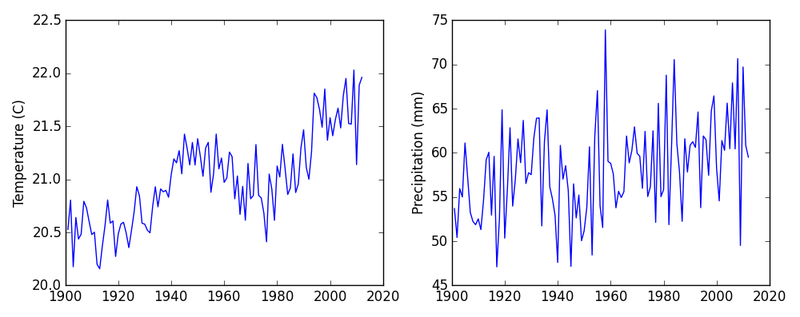

We now have almost everything we need to process all our data files.
The only thing that's missing is a library with a rather unpleasant name:

~~~
import glob
~~~
{: .python}

The `glob` library contains a function, also called `glob`,
that finds files and directories whose names match a pattern.
We provide those patterns as strings:
the character `*` matches zero or more characters,
while `?` matches any one character.
We can use this to get the names of all the CSV files in the current directory:

~~~
print(glob.glob('*.csv'))
~~~
{: .python}

~~~
['CAN.csv', 'MEX.csv', 'USA.csv']
~~~
{: .output}

As these examples show,
`glob.glob`'s result is a list of file and directory paths.
This means we can loop over it
to do something with each filename in turn.
In our case,
the "something" we want to do is generate a set of plots for each file in our dataset.

Now, depending on your computer, the files might be listed in a random order.
To guarantee that they are consistently ordered, we can use the `sorted` built-in function to generate a new sorted list from the `glob.glob` output:

~~~
import numpy
import matplotlib.pyplot as plt

filenames = sorted(glob.glob('*.csv'))
for f in filenames:
    print(f)

    data = numpy.loadtxt(fname=f, delimiter=',', skiprows=1)

    fig = plt.figure(figsize=(10.0, 4.0))

    axes1 = fig.add_subplot(1, 2, 1)
    axes2 = fig.add_subplot(1, 2, 2)

    axes1.set_ylabel('Temperature (C)')
    axes1.plot(data[:,0], data[:,1])

    axes2.set_ylabel('Precipitation (mm)')
    axes2.plot(data[:,0], data[:,2])

    fig.tight_layout()
    plt.show()
~~~
{: .python}

~~~
CAN.csv
~~~
{: .output}

~~~
MEX.csv
~~~
{: .output}

~~~
USA.csv
~~~
{: .output}

Sure enough,
we can plot all the datasets with one piece of code.
If we get the data for some other countries, we can
put it in the same folder and it will be included.
